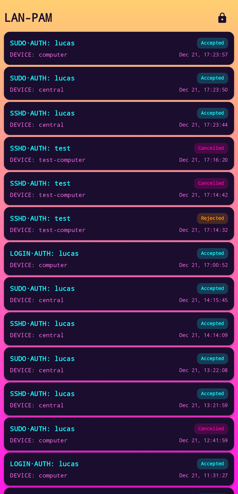

# LAN-PAM

[PAM](https://man7.org/linux/man-pages/man8/pam.8.html) that delegates authentication to trusted devices in your local network.

I found other projects that try to achieve the same thing but they have some pretty strict limitations and obvious security vulnerabilities.
I tried to keep this project as small and safe as possible while still providing all the features I want.

The entire PAM side of things is a single Rust file, written in a way that makes it easy to understand.

## Key features

- Network communication is fully encrypted using public/private key pairs generated on the device itself
- Multiple machines can use the same device for requests
- Multiple devices can be used to accept or reject requests on the same machine

## App features

- Automatically generates public/private key pair when it first starts
- Private keys are stored securely in the device's keystore and never leave the device
- Always runs in the background with a visible notification
- Starts automatically at boot
- Phone needs to be unlocked to accept or reject requests, adding an extra layer of security
- History of past requests including timestamps and status
- Nice synthwave theme



## Motivation

My home infrastructure has grown quite a lot in recent years and I find it hard to strike the right balance between convenience and security.
I want to be able to connect to different machines inside my network easily and without much friction.
At the same time, I don't want my entire system to be compromised in case a single machine is.
I also have a lot of smart home devices running on my local network from many different vendors, and I think it's best to assume that the network itself is also not trusted.

So what I should do is:
- Not have any `authorized_keys`
- Have very secure passwords
- Have different passwords for every machine

Doing all of that will make connecting to other machines quite painful and that's a problem because I connect to them a lot.

So instead what I want is a single, trusted device that I can use to *easily* yet *securely* approve any `ssh`, `sudo`, or `login` requests.
My phone seemed like the perfect solution since I, as a slave to technology, have it with me at all times and it adds the requirement of having physical access to my unlocked phone.
## How it works

There are two components to the system currently (although I plan to add other devices):

- `pam-exec/` - Binary executed by PAM via `pam_exec`
- `android-app/` - Android app for approving/denying authentication requests

When a request comes in, the `lan-pam` binary will send out a request to each configured device via TCP (port 4200 for the app by default).
Every device has its own public/private key pair used for encrypting the request.
Every device decrypts the request and allows the user to accept or reject.
The first *correctly encrypted* accepted/rejected message is accepted as the result of the request.
After that, all remaining TCP connections are closed, informing the other devices that the request was cancelled.
By design, it is not possible for the other devices to tell whether the request was accepted, rejected, or timed out.

## Using with NixOS

Here is how to add `LAN-PAM` to NixOS using the (currently unstable) PAM API.

Flake input
```nix
lan-pam = {
  url = "github:ve5li/lan-pam?dir=pam-exec";
  inputs.nixpkgs.follows = "nixpkgs";
};
```

Configuration:
```nix
let
  configuration = {
    source_name = config.role-configuration.host-name;
    devices = [
      {
        name = "Phone";
        ip_address = "<Phone ip>:4200";
        # You can get the public key by clicking the button in the app.
        public_key = "<Phone public key>";
      }
    ];
  };

  configuration-file = pkgs.writeText "config.json" (lib.strings.toJSON configuration);
in {
  security.pam.services.login.rules.auth.lan-pam = {
    enable = true;
    # Sufficient means that a success from LAN-PAM will be enough to log you in.
    # If LAN-PAM fails it will go to the next item in the stack, likely asking
    # for a password to log the user in instead.
    control = "sufficient";
    # Run before `unix-early`, which will prompt for the password.
    order = config.security.pam.services.login.rules.auth.unix-early.order - 1;
    # Use `pam_exec`.
    modulePath = "${config.security.pam.package}/lib/security/pam_exec.so";
    args = [
      "quiet"
      "log=/var/run/lan-pam.log"
      "${lib.getExe lan-pam.packages.${pkgs.stdenv.hostPlatform.system}.default}"
      "${configuration-file}"
    ];
  };
}
```

This configuration will make a login attempt trigger a notification on your phone that you can then approve or reject.
In case the phone is not reachable or rejects the login, PAM will fall back to password based login.

For a more comprehensive setup, you can check my [actual configuration](https://github.com/vE5li/infrastructure/blob/main/nixos-modules/lan-pam.nix) which has the nice benefit of also requesting approval for every `root` session.
This is especially nice for tools like `colmena` that require an `authorized_key` to `root`.

## Testing

The `pam-exec` directory contains a Nix flake with a development shell and test configurations:

```bash
cd pam-exec
# Only necessary if you don't have direnv
nix develop
cargo run -- $EMULATOR_CONFIG
```

I test the Android app using `android-studio` and deploy it to my phone the same way.

## Known issues

`pam_exec.so` does not propagate signals, therefore it is impossible to to cancel a running request using `ctrl+c`.
I hope to get around this in the future by converting this into a proper module, rather than going through `pam_exec`.
